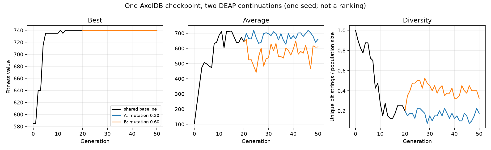

# DEAP + AxolDB: knapsack

**One population. Two evolutionary paths.**

DEAP initializes, evaluates, selects, crosses and mutates a 40-member population over the fixed
20-item dataset in `data/items.json`. AxolDB stores generations 0–20 of the baseline, then two
generation-20 restorations continue to generation 50 with mutation probabilities 0.20 and 0.60.
The crossover rate, selection, dataset, population size and checkpoint RNG state remain the same.



This one-seed run demonstrates checkpointing and comparison. It does not show that either mutation
strategy is generally better.

## Where this could be useful

**Demonstrated here:** a complete generation-20 DEAP population and the application state needed
to resume it are read back from AxolDB in new Python processes. Two parameter choices start from
that same saved population, and the retained report compares best fitness, average fitness and
candidate diversity across later generations—not only the single best candidate.

**Potential uses:** the same pattern could help resume an expensive evolutionary run, compare
parameters from one controlled initial population, or retain earlier generations for later
analysis. It may also help collaborators refer to the same durable experiment state, but this
example did not test concurrent teamwork, access governance across a team, time saved, or
scalability. For a small one-off experiment, a simple checkpoint file may be easier and fully
adequate.

## What AxolDB stores

Each generation contains canonical ACE-1 binary genotypes for candidate bit strings and fitness,
with Population multiplicity preserving repeated candidates. A separate manifest genotype records
ordered candidate hashes, generation, Python and NumPy RNG states, all algorithm parameters,
example/dependency versions, dataset SHA-256 and provenance. `checkpoint-ref.json` contains only
AxolDB IDs and hashes; it is not a state snapshot. The two workers must read the manifest and every
candidate from AxolDB in a new Python process.

This uses **application-level provenance**, not a native Fork. AxolDB Server v1 exposes Fork create
and read, but not external fork-generation publication; that operation requires a real Evolution
Run and remote Evolution execution is deferred.

## Compatibility and dependencies

The retained result was executed on Fedora Linux x86-64 with Python 3.14.7 against AxolDB
`0.1.0-developer-preview+88e7d71571c0b04641d46b7f699dbab84fe463a3`, public HTTP/JSON v1,
PostgreSQL 16.15, DEAP 1.4.4, NumPy 2.5.3 and Matplotlib 3.11.2. Python 3.12–3.14 is accepted by the
package. Windows: **NOT RUN**.

The example-only `axol_api.py` adapter is not the official Python SDK. The official SDK exists in
product source but was not publicly registry-published or authorized for inclusion in this ZIP.
The adapter implements only version, genotype insert/read, Population create/read, Generation
read and Transaction publish, using the documented ACE-1 binary and genotype-hash contracts.

## Prepare AxolDB securely

Use a fresh or deliberately selected AxolDB Developer Preview instance. Export its public instance
CA. Put a dedicated bearer credential in a file readable only by its owner; do not put the token in
the command line, environment value or repository.

For the default namespace, grant the example principal exactly:

| Action | Resource | Resource identity |
| --- | --- | --- |
| `Insert` | `Population` | `null` |
| `Read` | `Population` | each of the three IDs below |
| `Insert` | `IndividualGenotype` | each of the three IDs below |
| `Read` | `IndividualGenotype` | each of the three IDs below |
| `PublishGeneration` | `Population` | each of the three IDs below |

The three IDs are `axol://populations/examples.deap-knapsack/baseline`, `.../branch-a`, and
`.../branch-b`. A custom canonical two-segment namespace can be supplied through
`AXOL_EXAMPLE_NAMESPACE`; grant its three exact resulting IDs instead.

```bash
python3 -m venv .venv
.venv/bin/python -m pip install -r requirements.lock .
export AXOLDB_ENDPOINT='https://localhost:PORT'
export AXOLDB_CA_FILE='/absolute/path/to/axoldb-instance-ca.crt'
export AXOLDB_CREDENTIAL_FILE='/absolute/path/to/mode-600-credential-file'
.venv/bin/python run_demo.py
```

The run writes `results/results.json`, branch results, the small checkpoint reference and
`results/comparison.png`. A fresh namespace/instance is required because Server v1 intentionally
has no Population-delete capability.

## Verify

```bash
.venv/bin/python -m pytest -q
AXOLDB_E2E=1 .venv/bin/python -m pytest -q tests/test_e2e.py
```

The real test compares ordered bit strings, fitness, membership hashes and final metrics between
an uninterrupted generation-50 run and a generation-20 checkpoint restored from AxolDB in a new
process. It also checks both branches name the same source and that the source Generation summary,
state root and manifest are unchanged afterward. Random server IDs are not compared across runs.

## Inspect in Axol Studio

Open **Populations** and paste one of the three IDs above. The retained run's shared checkpoint is
Generation `6762dec5-770b-4d64-a816-e61d1296720e`; fresh executions print their actual IDs. Inspect
the current and earlier Generations for each Population. Treat the provenance fields in the
manifest as application data, not Studio/native Fork lineage.

Measured final metrics for the retained run were: A best 740, average 660.0, diversity 0.175; B
best 740, average 609.25, diversity 0.325. Diversity is unique candidate bit strings divided by
population size. Duration was 47.50 seconds for the example process; this is scope information,
not a performance claim.

## Cleanup and limitations

Revoke the dedicated credential after use. Stop the AxolDB instance with its public `axol server
stop` command. If and only if the instance was created solely for this example, remove its exact
instance directory using the platform's normal file-management procedure after it is stopped.
Server v1 has no per-Population delete operation.

No arbitrary pickle is loaded. Checkpoints use canonical JSON carried in ACE-1 binary values. The
example is small, uses one seed and does not benchmark AxolDB or prove strategy superiority.

The example code and documentation are available under the [MIT license](LICENSE). AxolDB and the
Python dependencies retain their separate terms; see
[THIRD-PARTY-NOTICES.md](THIRD-PARTY-NOTICES.md).
