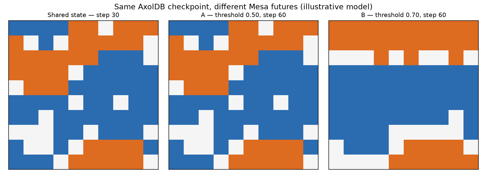

# Mesa + AxolDB: Schelling model

**Same starting point. Different futures.**

Mesa runs an illustrative 10×10 toroidal Schelling model with 80 stable residents. An agent is
satisfied when at least the configured fraction of occupied Moore neighbors has the same group.
Unsatisfied agents move to a random empty cell in Mesa's shuffled activation order. The baseline
runs to step 30; two new processes restore that state and continue to step 60 with thresholds 0.50
and 0.70.



This is an illustrative computational model, not an empirical prediction of real cities.

## Where this could be useful

**Demonstrated here:** a complete step-30 Mesa state is read back from AxolDB in new Python
processes. Two threshold scenarios resume from that same saved state, while earlier Generations and
the application-level source references remain available for inspection.

**Potential uses:** the pattern could help resume a long-running simulation, compare scenarios
from a shared saved state, or retain an experiment history with explicit application provenance.
It may also benefit collaborative research in which participants need to identify the same saved
state, but this example did not test concurrent collaboration, time saved, or scalability. For a
small one-off simulation, a simple checkpoint file may be easier and fully adequate.

## What AxolDB stores

Every Generation contains one canonical resident genotype per stable application identity,
including group and position. A manifest genotype records dimensions, torus topology, density,
threshold, step, total moves, Python and NumPy RNG states, Mesa's stable activation base order,
dependency/example versions and provenance. Equal attributes never merge different residents.
The small `checkpoint-ref.json` stores only AxolDB IDs and hashes, so restoration must read the
manifest and all residents from AxolDB.

This uses **application-level provenance** and two ordinary Populations. It is not native Fork
lineage: Server v1 cannot publish an external process's fork descendants without an Evolution Run,
and remote Evolution execution is deferred.

## Compatibility and dependencies

The retained result ran on Fedora Linux x86-64 with Python 3.14.7 against AxolDB
`0.1.0-developer-preview+88e7d71571c0b04641d46b7f699dbab84fe463a3`, public HTTP/JSON v1,
PostgreSQL 16.15, Mesa 3.5.1, NetworkX 3.7, NumPy 2.5.3 and Matplotlib 3.11.2. Python 3.12–3.14 is
accepted. Windows: **NOT RUN**.

`axol_api.py` is a deliberately small example adapter, not the official Python SDK. The official
SDK was not publicly registry-published or authorized for inclusion in this archive.

## Prepare and run

Store a dedicated bearer credential in a mode-600 file and export only its path. Export the exact
AxolDB instance CA and use an `https://` origin. Never disable certificate or hostname validation.

For the default namespace grant `Insert` on `Population` with `null` identity, then grant `Read`
on `Population`, `Insert` and `Read` on `IndividualGenotype`, and `PublishGeneration` on
`Population` for each exact ID: `axol://populations/examples.mesa-schelling/baseline`,
`.../branch-a`, and `.../branch-b`. These are the 13 grants required by this example. If setting
`AXOL_EXAMPLE_NAMESPACE`, grant the three corresponding canonical IDs instead.

```bash
python3 -m venv .venv
.venv/bin/python -m pip install -r requirements.lock .
export AXOLDB_ENDPOINT='https://localhost:PORT'
export AXOLDB_CA_FILE='/absolute/path/to/axoldb-instance-ca.crt'
export AXOLDB_CREDENTIAL_FILE='/absolute/path/to/mode-600-credential-file'
.venv/bin/python run_demo.py
```

Outputs are `results/results.json`, two branch JSON files, `checkpoint-ref.json`, and
`results/scenarios.png`. Use a fresh namespace or instance for another run because public v1 has
no Population-delete operation.

## Verify and inspect

```bash
.venv/bin/python -m pytest -q
AXOLDB_E2E=1 .venv/bin/python -m pytest -q tests/test_e2e.py
```

The E2E test compares stable IDs, groups, positions, both RNG states, activation base order, move
count and metrics between uninterrupted and AxolDB-restored threshold-0.50 runs. It checks both
scenarios have the same step-30 signature and the source checkpoint remains unchanged.

In Axol Studio, open **Populations** and paste any of the three IDs above. The retained step-30
Generation is `d46ac37d-fd6e-4d63-97c0-cefeb2607f70`; fresh runs print their own IDs. Inspect earlier
Generations and current state for each Population. The manifest provenance is application data,
not native Fork lineage.

Retained final metrics: A made 0 moves after the checkpoint, satisfied fraction 1.0, clustering
0.81829; B made 324 moves, satisfied fraction 0.9625, clustering 0.95226. Clustering is the mean,
over residents, of the same-group fraction among occupied Moore neighbors (isolated agents count
as 1.0). Duration was 113.23 seconds; this is observed scope, not a speed claim.

## Cleanup and limitations

Revoke the dedicated credential and stop the instance with `axol server stop`. Only for a fully
disposable example instance, remove its exact stopped instance directory using normal file
management. There is no public per-Population cleanup endpoint.

The model uses one seed and is not a policy, social-science or threshold ranking result. Windows
was not run. The example code and documentation are available under the [MIT license](LICENSE).
AxolDB and the Python dependencies retain their separate terms; see
[THIRD-PARTY-NOTICES.md](THIRD-PARTY-NOTICES.md).
